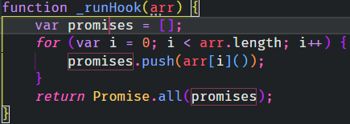

# NEVER BE LOST • theme for VS CODE

[Never be Lost](https://github.com/Fred-Vatin/never-be-lost) © 2022 by [Fred Vatin](https://github.com/Fred-Vatin) is licensed under [CC BY-SA 4.0](http://creativecommons.org/licenses/by-sa/4.0/?ref=chooser-v1)

Never be lost in the interface of VS Code. Always know where is the focus and each element while being elegant.

**Please rate the extension on the [marketplace](https://marketplace.visualstudio.com/items?itemName=Fred-Vatin.never-be-lost) if you like it. It will be greatly apreciated.**

## Features

1. Elegant dark themes in night and day flavors

| Day                                                          | Night                                                     |
| ------------------------------------------------------------ | --------------------------------------------------------- |
|  |  |

2. Very advanced tokenization colors for every language

| Default                                                      | Never be Lost                                          |
| ------------------------------------------------------------ | ------------------------------------------------------ |
| js       | js       |
| json | json |
| css    | css    |

3. Always know where the focus is, what is the active editor and file. Very useful using groups.

| Default                                                    | Never be Lost                                        |
| ---------------------------------------------------------- | ---------------------------------------------------- |
|  |  |

## Installation

### From the marketplace

1. Search for `Fred-Vatin.never-be-lost` in the _**extensions**_ section of your VS Code or go to the [marketplace](https://marketplace.visualstudio.com/items?itemName=Fred-Vatin.never-be-lost&ssr=false#overview).
2. Click on the `install` button.
3. The theme should preview. Press enter to validate

### From the CLI

With [shell commands](https://code.visualstudio.com/docs/editor/command-line) installed, you can use the following command to install the extension:

`$ code --install-extension Fred-Vatin.never-be-lost`

## Override this theme

You can customize this theme or any other one.

Please follow the guide in the [color theme](https://code.visualstudio.com/api/extension-guides/color-theme) documentation. This is handy for small tweaks to the theme without having to fork and maintain your own theme.

To override a specific theme only, use this model in your user settings :

```jsonc
"workbench.colorCustomizations": {
	"[Never be lost (Day)]": {
		// your customization here
	}
}
```

and

```jsonc
"editor.tokenColorCustomizations": {
	"[Never be lost (Day)]": {
		// your customization here
	}
}
```

## Important settings

`editor.occurrencesHighlight` controls whether the editor should highlight semantic symbol occurrences. If it is too distracting, I advise you to set it to **false**.

> **Note** : there may be a bug in JSON files where when this setting is enabled, `editor.selectionHighlightBackground` color is applied when no selection. Check this [issue](https://github.com/microsoft/vscode/issues/167766) to track if it’s been fixed.



## VS Codes issues to follow

- [#167785](https://github.com/microsoft/vscode/issues/167785) Background color of lines overlaps
- [#167766](https://github.com/microsoft/vscode/issues/167766) `editor.selectionHighlight…` colors are applied while non selected text in JSON

## Post your issue

Help to fix bugs and to improve this theme. Post an [issue](https://github.com/Fred-Vatin/never-be-lost/issues) on github.

Pull requests are accepted.

## Support me

If you like my work, you can offer me a coffee or sponsor me [here](https://github.com/sponsors/Fred-Vatin).
